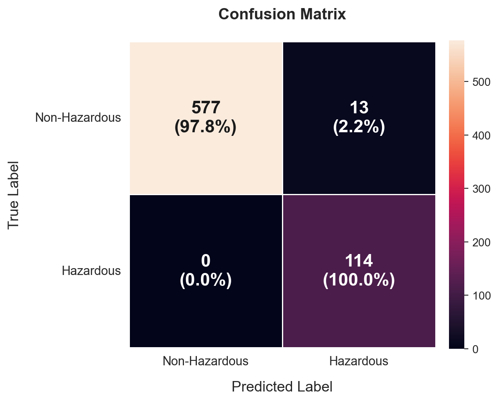

# Asteroid Hazard Classification

This project is a binary classifier that predicts whether a Near-Earth Object is hazardous, built from NASA's asteroid dataset. I used this project to work directly in PyTorch, structured as a series of controlled experiments: comparing model families, handling class imbalance, adding training stability techniques like early stopping and checkpointing, then trying different architectures and classification thresholds together.

## Overview

Asteroid hazard labels are heavily imbalanced, the hazardous objects being the rare class, so the project centers as much on handling that imbalance correctly as on the modeling itself. The workflow moves from a simple baseline through a systematic architecture and threshold search, with early stopping and checkpointing to keep training honest.

## Dataset

[NASA Asteroids Classification](https://www.kaggle.com/datasets/shrutimehta/nasa-asteroids-classification) — orbital and physical measurements (diameter, velocity, miss distance, magnitude, orbital elements, etc.) for near-Earth objects, labeled hazardous or non-hazardous.

- **Samples:** 4687
- **Features used:** 18, after dropping identifier/date columns and redundant unit conversions
- **Class balance:** 16.1% hazardous / 83.9% non-hazardous

## Approach

### 1. Baseline comparison
I first trained a logistic regression model and a baseline feedforward neural network on the same features, both with class-imbalance correction (weighted loss). The neural network outperformed logistic regression, justifying the added complexity for this problem.

| Model | Precision | Recall | F1 |
|---|---|---|---|
| Logistic Regression | 0.6034 | 0.9211 | 0.7292 |
| Baseline NN (64-32)| 0.8321 | 1.000 | 0.9084 |

### 2. Training stability
To improve training stability, I added an early stopping mechanism on validation loss, with the model checkpoint saved from the epoch with the lowest validation loss rather than the final epoch. This avoids overfitting to the training set and makes results reproducible regardless of how long training runs.

### 3. Architecture search
To experiment with different architectures, I compared four feedforward architectures, all trained with the same imbalance-aware loss:

| Architecture | Layers |
|---|---|
| 16-8 | 18 → 16 → 8 → 1 |
| 32-16 | 18 → 32 → 16 → 1 |
| 64-32 | 18 → 64 → 32 → 1 |
| 128-64-32 | 18 → 128 → 64 → 32 → 1 |

For each architecture, I also swept classification thresholds rather than defaulting to 0.5, since the optimal precision/recall tradeoff shifts with model capacity.

**Result:** the 32-16 architecture at a 0.5 threshold gave the best balance of precision and recall on the hazardous class — outperforming both the smaller network (underfit) and the larger ones (added capacity without added performance, at higher risk of overfitting).
 
| Architecture | Best Threshold | Precision | Recall | F1 |
|---|---|---|---|---|
| 16-8 | 0.5 | 0.8496 | 0.9912 | 0.9150 |
| 32-16 | 0.5 | 0.8976 | 1.0000 | 0.9461 |
| 64-32 | 0.5 | 0.8321 | 1.0000 | 0.9084 |
| 128-64-32 | 0.4 | 0.8222 | 0.9737 | 0.8916 |
 
## Results

**Final model:** 18 → 32 → 16 → 1, threshold = 0.5

- Accuracy: 0.9815
- Precision: 0.8976
- Recall: 1.0000
- F1: 0.9461



## What I learned

- Accuracy alone is misleading on imbalanced data. Precision/recall on the minority (hazardous) class is what actually matters here, since missing a real hazardous asteroid is a worse failure than a false alarm.
- More parameters isn't automatically better: the 128-64-32 architecture didn't outperform 32-16, which is a useful reminder to treat model size as a hyperparameter to tune, not a lever to maximize.
- Threshold and architecture interaction: the best threshold for one architecture isn't necessarily best for another, so tuning them independently would have missed the actual optimal tuning.

## Next steps

- Sweep learning rates systematically (currently fixed at 0.001)
- Add dropout to test whether regularization improves generalization on the medium architecture

## Setup

```bash
pip install torch pandas scikit-learn numpy
```
